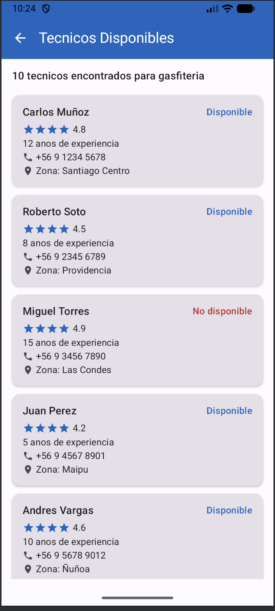
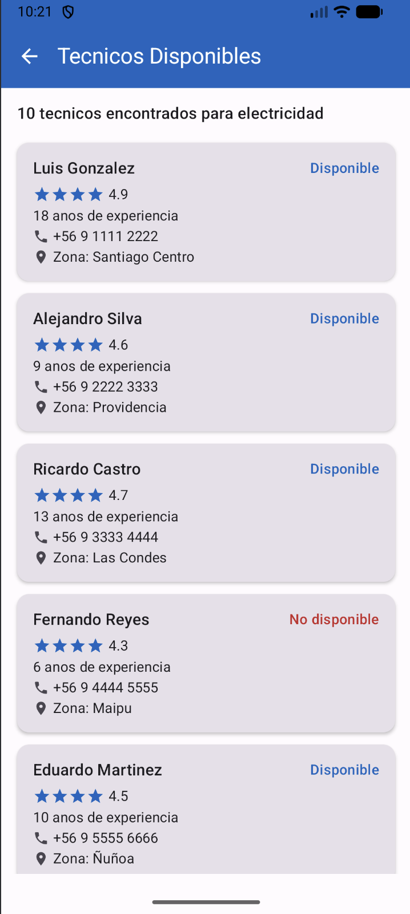
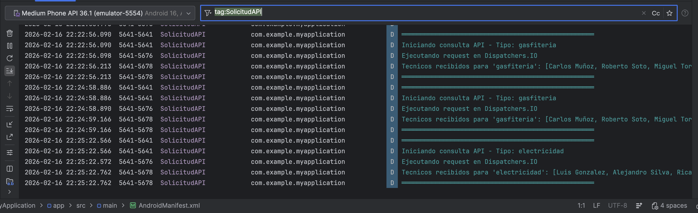
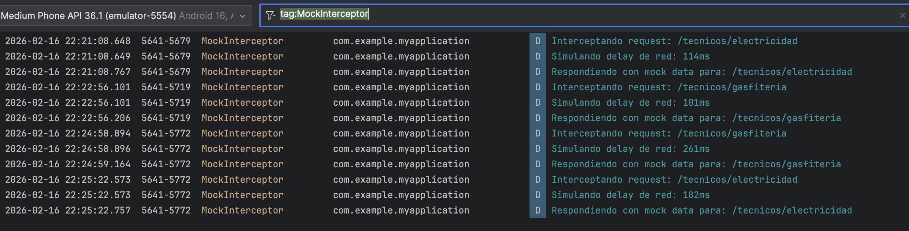
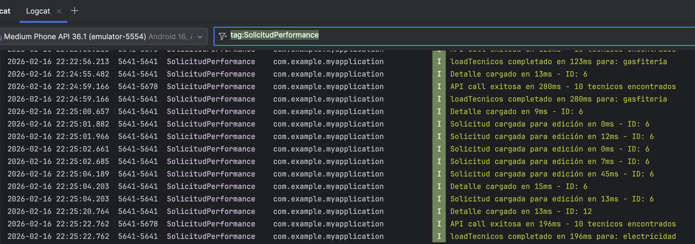
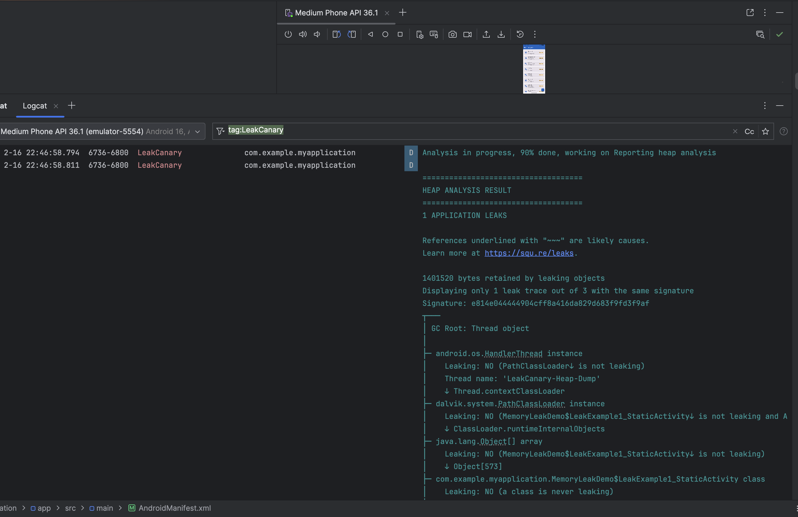
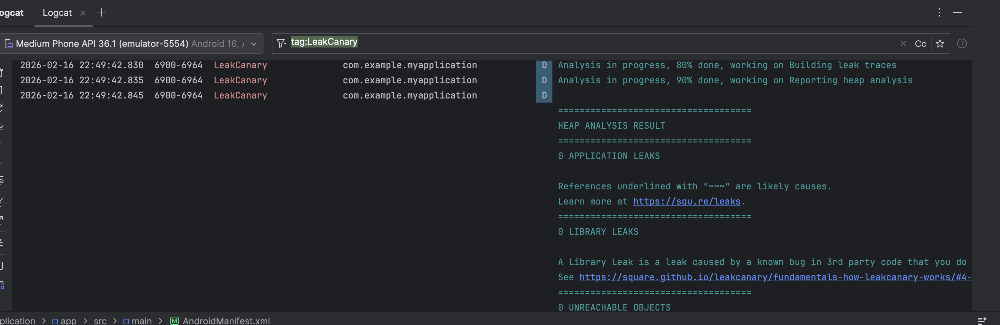

# Necesitas Ayuda?

Aplicacion Android desarrollada con Jetpack Compose para la startup "Necesitas Ayuda?" que conecta personas con prestadores de servicios a domicilio.

## Descripcion

Esta aplicacion permite gestionar solicitudes de servicios a domicilio en tres categorias:
- **Gasfiteria**: Reparacion de canerias, llaves, filtraciones
- **Electricidad**: Instalaciones y reparaciones electricas
- **Electrodomesticos**: Reparacion de refrigeradores, lavadoras, etc.

Desarrollada como actividad formativa para el curso "Desarrollo App Moviles II" de Duoc UC.

## Capturas de Pantalla

La aplicacion consta de 3 pantallas principales:

1. **HomeScreen** - Lista de solicitudes con estado
2. **FormScreen** - Formulario para crear/editar solicitudes
3. **DetailScreen** - Detalle de solicitud con opciones de gestion

## Requisitos Tecnicos

- Android Studio Hedgehog (2023.1.1) o superior
- Kotlin 2.0.0
- Jetpack Compose BOM 2024.09.00
- MinSDK: 25 (Android 7.1)
- TargetSDK: 35 (Android 15)

## Arquitectura

```
app/src/main/java/com/example/myapplication/
├── MainActivity.kt                 # Activity principal
├── MemoryLeakDemo.kt               # Ejemplos educativos de memory leaks (Semana 6)
├── data/
│   ├── local/
│   │   ├── AppDatabase.kt          # Room Database singleton
│   │   ├── SolicitudDao.kt         # Data Access Object
│   │   └── SolicitudEntity.kt      # Entidad de base de datos
│   ├── remote/                      # Capa de red (Semana 6)
│   │   ├── ApiService.kt           # Interface Retrofit
│   │   ├── MockInterceptor.kt      # Interceptor OkHttp con datos mock
│   │   ├── NetworkResult.kt        # Sealed class: Loading, Success, Error
│   │   ├── RetrofitClient.kt       # Singleton Retrofit + OkHttp
│   │   └── dto/
│   │       ├── TecnicoDto.kt       # Modelo de datos del tecnico
│   │       └── TecnicosResponse.kt # Wrapper de respuesta API
│   └── repository/
│       ├── SolicitudRepository.kt  # Repositorio de solicitudes
│       └── TecnicoRepository.kt    # Repositorio de tecnicos (Semana 6)
├── viewmodel/
│   ├── SolicitudViewModel.kt       # ViewModel de solicitudes
│   └── TecnicoViewModel.kt         # ViewModel de tecnicos (Semana 6)
├── navigation/
│   └── NavGraph.kt                 # Configuracion de navegacion
└── ui/
    ├── components/
    │   └── SolicitudCard.kt        # Card reutilizable
    ├── screens/
    │   ├── HomeScreen.kt           # Lista de solicitudes
    │   ├── FormScreen.kt           # Formulario CRUD
    │   ├── DetailScreen.kt         # Detalle con BottomSheet
    │   └── TecnicosScreen.kt       # Directorio de tecnicos (Semana 6)
    └── theme/
        ├── Color.kt                # Colores WCAG AA
        ├── Type.kt                 # Tipografia min 14sp
        └── Theme.kt                # Tema light/dark
```

## Tecnologias y Dependencias

| Tecnologia | Version | Proposito |
|------------|---------|-----------|
| Room Database | 2.6.1 | Persistencia local |
| Navigation Compose | 2.7.7 | Navegacion entre pantallas |
| Material 3 | BOM 2024.09.00 | Componentes de UI |
| Lifecycle ViewModel | 2.6.1 | Gestion de estado |
| Kotlin Coroutines | 1.7.3 | Operaciones asincronas |
| KSP | 2.0.0-1.0.21 | Procesador de anotaciones |
| Retrofit | 2.9.0 | Cliente API REST (Semana 6) |
| OkHttp | 4.12.0 | Cliente HTTP con interceptores (Semana 6) |
| Gson | 2.10.1 | Serializacion/deserializacion JSON (Semana 6) |
| LeakCanary | 2.14 | Deteccion de memory leaks (Semana 5-6) |

## Componentes UI Avanzados

| Componente | Ubicacion | Uso |
|------------|-----------|-----|
| LazyColumn | HomeScreen | Lista scrollable de solicitudes |
| AlertDialog | FormScreen, DetailScreen | Seleccion de servicio, confirmacion |
| ModalBottomSheet | DetailScreen | Cambio de estado |
| CircularProgressIndicator | FormScreen | Indicador de carga durante guardado |
| Toast | FormScreen, DetailScreen | Feedback de acciones |

## Optimizacion con Coroutines (Semana 3)

### Mejoras Implementadas

La aplicacion implementa Kotlin Coroutines para optimizar las operaciones asincronas:

| Caracteristica | Implementacion |
|----------------|----------------|
| Estados de carga | `isSaving`, `isDeleting` con StateFlow |
| Dispatcher explicito | `withContext(Dispatchers.IO)` para operaciones de BD |
| Prevencion de duplicados | Verificacion de estado antes de ejecutar |
| Manejo de errores | try-catch con feedback al usuario |

### Flujo Optimizado

```kotlin
// Ejemplo de operacion optimizada
viewModelScope.launch {
    _isSaving.value = true
    try {
        withContext(Dispatchers.IO) {
            repository.insertSolicitud(solicitud)
        }
        _uiEvent.emit(UiEvent.ShowToast("Guardado correctamente"))
    } catch (e: Exception) {
        _uiEvent.emit(UiEvent.ShowToast("Error: ${e.localizedMessage}"))
    } finally {
        _isSaving.value = false
    }
}
```

### Beneficios

- **UI responsiva**: La interfaz nunca se bloquea durante operaciones
- **Feedback visual**: Indicador de progreso durante guardado
- **Prevencion de errores**: Boton deshabilitado durante operaciones
- **Robustez**: Manejo gracioso de errores con mensajes informativos

## Debugging y Optimizacion (Semana 4)

### Logging con Logcat

Se implemento un sistema de logging estructurado con TAGs personalizados:

| TAG | Proposito |
|-----|-----------|
| `SolicitudViewModel` | Logs generales del ViewModel |
| `SolicitudCRUD` | Operaciones Create, Read, Update, Delete |
| `SolicitudPerformance` | Metricas de tiempo de ejecucion |
| `SolicitudValidation` | Validacion de datos del formulario |
| `SolicitudDB` | Operaciones en base de datos |
| `SolicitudRepository` | Capa Repository |

### Manejo de Excepciones

Se implementaron try-catch con excepciones especificas:

| Excepcion | Causa |
|-----------|-------|
| `SQLiteException` | Errores de base de datos |
| `IllegalStateException` | Estados invalidos |
| `IOException` | Errores de almacenamiento |
| `IllegalArgumentException` | Argumentos invalidos |

### Analisis de Rendimiento

- **CPU Profiler**: Analisis de consumo de CPU durante operaciones
- **Memory Profiler**: Heap Dump con 0 memory leaks detectados
- **Metricas de tiempo**: Medicion en ms de todas las operaciones CRUD

## Cumplimiento de Rubrica

### Semana 2 - Persistencia y UI

| Criterio | Pts | Estado |
|----------|-----|--------|
| Persistencia Local (Room) | 30 | Implementado - Entity, DAO, Repository |
| Interfaz Moderna | 25 | Implementado - LazyColumn, ModalBottomSheet, AlertDialog |
| Accesibilidad | 20 | Implementado - 14sp min, contentDescription, semantics |
| Organizacion MVVM | 15 | Implementado - data/, viewmodel/, ui/screens/ |
| Documentacion | 10 | Implementado - README.md completo |

### Semana 3 - Coroutines

| Criterio | Estado |
|----------|--------|
| Flujo critico identificado | Guardar/Editar solicitudes |
| Dispatchers.IO implementado | En todas las operaciones de BD |
| Estados de carga (StateFlow) | isSaving, isDeleting |
| Manejo de errores (try-catch) | Con feedback al usuario |
| Prevencion de operaciones duplicadas | Verificacion de estado |

### Semana 4 - Debugging y Optimizacion

| Criterio | Estado |
|----------|--------|
| Flujo critico seleccionado | `saveSolicitud()` con justificacion |
| Logcat con filtros y TAGs | 6 TAGs implementados |
| Try-catch estrategico | 4 excepciones especificas |
| Herramientas de Profiling | CPU Profiler + Memory Profiler |
| Informe tecnico | Documentado en `docs/` |

## Accesibilidad (WCAG AA)

La aplicacion cumple con estandares de accesibilidad:

- Tipografia minima de 14sp en todos los textos
- `contentDescription` en todos los iconos, botones e imagenes
- Alto contraste en colores:
  - Primary: #1565C0 (Azul)
  - Secondary: #2E7D32 (Verde)
  - Error: #C62828 (Rojo)
- Botones con altura minima de 56dp
- Encabezados semanticos con `semantics { heading() }`
- Soporte para TalkBack

## Modelo de Datos

### SolicitudEntity

| Campo | Tipo | Descripcion |
|-------|------|-------------|
| id | Long | ID autogenerado |
| tipoServicio | String | gasfiteria/electricidad/electrodomesticos |
| descripcion | String | Descripcion del problema |
| nombreCliente | String | Nombre del cliente |
| telefono | String | Telefono de contacto |
| direccion | String | Direccion del servicio |
| fechaSolicitud | Long | Timestamp de creacion |
| estado | String | pendiente/en_proceso/completado |

## Estados de Solicitud

| Estado | Color | Descripcion |
|--------|-------|-------------|
| Pendiente | Naranja | Esperando asignacion |
| En Proceso | Azul | Tecnico asignado |
| Completado | Verde | Servicio finalizado |

## Instalacion

1. Clonar el repositorio
2. Abrir en Android Studio
3. Sincronizar Gradle
4. Ejecutar en emulador o dispositivo fisico

```bash
# Compilar el proyecto
./gradlew assembleDebug

# Ejecutar tests
./gradlew test

# Generar APK
./gradlew assembleDebug
# APK ubicado en: app/build/outputs/apk/debug/app-debug.apk
```

## Flujo de Usuario

```
HomeScreen (Lista vacia)
    |
    v
[FAB +] --> FormScreen (Nueva solicitud)
    |           |
    |           v
    |       [Guardar] --> CircularProgressIndicator --> Toast
    |
    v
HomeScreen (Con solicitud)
    |
    v
[Tap Card] --> DetailScreen
    |
    ├── [Editar] --> FormScreen (Edicion)
    ├── [Cambiar Estado] --> BottomSheet
    ├── [Ver Tecnicos] --> TecnicosScreen (API Retrofit - Semana 6)
    └── [Eliminar] --> AlertDialog --> HomeScreen
```

## Integracion de Librerias Externas (Semana 6)

### Flujo Funcional Seleccionado

Se selecciono el flujo **DetailScreen -> Ver Tecnicos Disponibles -> TecnicosScreen** como flujo critico porque integra multiples tecnicas avanzadas:
- **Persistencia local** (Room) para la solicitud existente
- **Comunicacion de red** (Retrofit + OkHttp) para consultar tecnicos via API
- **Procesos asincronos** (Coroutines con Dispatchers.IO) para la llamada API
- **Manejo de errores** (try-catch con HttpException, IOException) en la capa de red
- **Estados reactivos** (StateFlow con NetworkResult sealed class) para Loading/Success/Error

### Libreria Externa: Retrofit 2 + OkHttp + Gson

Se integro **Retrofit 2.9.0** como libreria externa principal para comunicacion API REST, junto con **OkHttp 4.12.0** como cliente HTTP y **Gson 2.10.1** para serializacion JSON.

**Justificacion tecnica:**
- **Retrofit**: Es el estandar de la industria para APIs REST en Android. Permite definir endpoints como interfaces Kotlin con anotaciones (`@GET`, `@Path`), soporta coroutines nativamente con funciones `suspend`, y se integra con multiples convertidores de datos.
- **OkHttp**: Proporciona un cliente HTTP eficiente con soporte para interceptores, lo que permite implementar el `MockInterceptor` para simular respuestas de API sin servidor real, y el `HttpLoggingInterceptor` para debugging de requests/responses.
- **Gson**: Libreria de Google para conversion automatica entre JSON y objetos Kotlin (data classes), eliminando la necesidad de parseo manual.

**Archivos creados:**

| Archivo | Proposito |
|---------|-----------|
| `data/remote/ApiService.kt` | Interface Retrofit con endpoint `GET /tecnicos/{tipo}` |
| `data/remote/MockInterceptor.kt` | Interceptor OkHttp que simula API con datos mock chilenos |
| `data/remote/RetrofitClient.kt` | Singleton con OkHttpClient, timeouts 10s, Gson converter |
| `data/remote/NetworkResult.kt` | Sealed class para estados: Loading, Success, Error |
| `data/remote/dto/TecnicoDto.kt` | Data class del tecnico (nombre, especialidad, calificacion, etc.) |
| `data/remote/dto/TecnicosResponse.kt` | Wrapper de respuesta API (success, data, count, timestamp) |
| `data/repository/TecnicoRepository.kt` | Repository con Dispatchers.IO y manejo de errores |
| `viewmodel/TecnicoViewModel.kt` | ViewModel con StateFlow para estado reactivo |
| `ui/screens/TecnicosScreen.kt` | Pantalla con estados Loading/Success/Error |

### Directorio de Tecnicos - Capturas

**TecnicosScreen mostrando tecnicos de gasfiteria:**



**TecnicosScreen mostrando tecnicos de electricidad:**



### Procesos Asincronos en la Capa de Red

Todas las operaciones de red se ejecutan en `Dispatchers.IO` mediante coroutines:

```kotlin
// TecnicoRepository.kt - Ejecucion asincrona con manejo de errores
suspend fun getTecnicosByTipo(tipo: String): NetworkResult<List<TecnicoDto>> {
    return withContext(Dispatchers.IO) {
        try {
            val response = apiService.getTecnicosByTipo(tipo)
            NetworkResult.Success(response.data)
        } catch (e: HttpException) {
            NetworkResult.Error("Error del servidor: ${e.code()}")
        } catch (e: IOException) {
            NetworkResult.Error("Error de conexion")
        }
    }
}
```

El `MockInterceptor` simula un delay de red de 100-300ms para reproducir condiciones reales, lo que permite verificar que el `CircularProgressIndicator` funciona correctamente durante la carga.

### Debugging y Logging de la Capa de Red

Se implementaron TAGs adicionales para monitorear la comunicacion API:

| TAG | Proposito |
|-----|-----------|
| `SolicitudAPI` | Requests y responses de la API |
| `MockInterceptor` | Interceptor simulando respuestas |
| `RetrofitClient` | Configuracion del cliente HTTP |
| `SolicitudPerformance` | Tiempos de ejecucion de API calls |

**Logcat filtrando tag:SolicitudAPI:**



**Logcat filtrando tag:MockInterceptor:**



**Logcat filtrando tag:SolicitudPerformance:**



### Diagnostico de Memory Leaks con LeakCanary

Se utilizo **LeakCanary 2.14** para diagnosticar y prevenir memory leaks. Se creo el archivo `MemoryLeakDemo.kt` con 3 ejemplos educativos de leaks comunes en Android:

| Leak | Causa | Correccion |
|------|-------|------------|
| Referencia estatica a Activity | Lista estatica acumula Activities destruidos | Usar `WeakReference` |
| Handler sin cleanup | `postDelayed` mantiene referencia al Activity | `removeCallbacksAndMessages(null)` en `onDestroy` |
| Listener sin unregister | Listeners acumulados en singleton | `unregister()` en `onDestroy` |

**Leak detectado - Se provoco un leak con referencia estatica a Activity y LeakCanary detecto `1 APPLICATION LEAKS`:**



**Leak corregido - Se reemplazo la referencia directa por `WeakReference` y LeakCanary confirmo `0 APPLICATION LEAKS`:**



### Organizacion del Proyecto (MVVM)

El proyecto mantiene una separacion clara de responsabilidades siguiendo el patron MVVM:

| Capa | Carpeta | Responsabilidad |
|------|---------|-----------------|
| **Data - Local** | `data/local/` | Room Database, DAO, Entity |
| **Data - Remote** | `data/remote/` | Retrofit, ApiService, DTOs, Interceptors |
| **Repository** | `data/repository/` | Abstraccion de acceso a datos (local y remoto) |
| **ViewModel** | `viewmodel/` | Logica de negocio, estado con StateFlow |
| **UI** | `ui/screens/` | Pantallas stateless con Jetpack Compose |
| **Navigation** | `navigation/` | Rutas y navegacion entre pantallas |

### Cumplimiento Rubrica Semana 6

| Criterio | Pts | Estado |
|----------|-----|--------|
| 1. Flujo funcional critico | 10 | DetailScreen -> API Retrofit -> TecnicosScreen |
| 2. Procesos asincronos (Coroutines) | 15 | Dispatchers.IO en TecnicoRepository, StateFlow en ViewModel |
| 3. Debugging y manejo de errores | 10 | try-catch (HttpException, IOException), Logcat con TAGs |
| 4. Memory leaks (LeakCanary) | 10 | Leak detectado, corregido con WeakReference, documentado |
| 5. Libreria externa (Retrofit+OkHttp+Gson) | 15 | Integrada, funcional y justificada tecnicamente |
| 6. Estructura MVVM | 10 | Capas separadas: data/remote, repository, viewmodel, ui |
| 7. Entrega GitHub (APK + README + capturas) | 15 | README completo, capturas en docs/screenshots/semana6/ |
| 8. Informe tecnico PDF | 15 | Documentado con todas las secciones requeridas |

## Estructura de Entregables

```
MyApplication/
├── app/src/main/java/com/example/myapplication/
│   ├── MemoryLeakDemo.kt                         # Ejemplos memory leaks
│   ├── viewmodel/
│   │   ├── SolicitudViewModel.kt                  # Con logging y try-catch
│   │   └── TecnicoViewModel.kt                    # ViewModel API (Semana 6)
│   └── data/
│       ├── repository/
│       │   ├── SolicitudRepository.kt             # Con logging
│       │   └── TecnicoRepository.kt               # Repository API (Semana 6)
│       └── remote/                                # Capa de red (Semana 6)
│           ├── ApiService.kt
│           ├── MockInterceptor.kt
│           ├── RetrofitClient.kt
│           ├── NetworkResult.kt
│           └── dto/
│               ├── TecnicoDto.kt
│               └── TecnicosResponse.kt
├── docs/
│   ├── INFORME_SEMANA4_DEBUGGING_OPTIMIZACION.md  # Informe Semana 4
│   └── screenshots/
│       ├── semana6/
│       │   ├── tecnicos_gasfiteria.png            # TecnicosScreen gasfiteria
│       │   ├── tecnicos_electricidad.png          # TecnicosScreen electricidad
│       │   ├── logcat_solicitud_api.png           # Logcat tag:SolicitudAPI
│       │   ├── logcat_mock_interceptor.png        # Logcat tag:MockInterceptor
│       │   ├── logcat_performance.png             # Logcat tag:SolicitudPerformance
│       │   ├── leakcanary_leak_detectado.png      # LeakCanary: 1 APPLICATION LEAK
│       │   └── leakcanary_leak_corregido.png      # LeakCanary: 0 APPLICATION LEAKS
│       ├── logcat_crud.png                        # Evidencia Logcat Semana 4
│       ├── profiler_cpu.png                       # CPU Profiler Semana 4
│       └── profiler_memory.png                    # Memory Profiler Semana 4
└── README.md
```

## Verificacion de Funcionalidad

1. Compilar y ejecutar la app
2. Verificar estado vacio inicial
3. Crear nueva solicitud con FAB
4. **Verificar indicador de carga durante guardado**
5. **Verificar que boton se deshabilita durante guardado**
6. Seleccionar tipo de servicio (AlertDialog)
7. Completar formulario y guardar
8. Ver solicitud en lista (HomeScreen)
9. Abrir detalle de solicitud
10. Cambiar estado (ModalBottomSheet)
11. Editar solicitud
12. Eliminar solicitud (AlertDialog confirmacion)
13. Cerrar y reabrir app - verificar persistencia
14. Probar con TalkBack para validar accesibilidad

## Autor

Desarrollado para Duoc UC - Curso Desarrollo App Moviles II

## Licencia

Este proyecto es para fines educativos.
