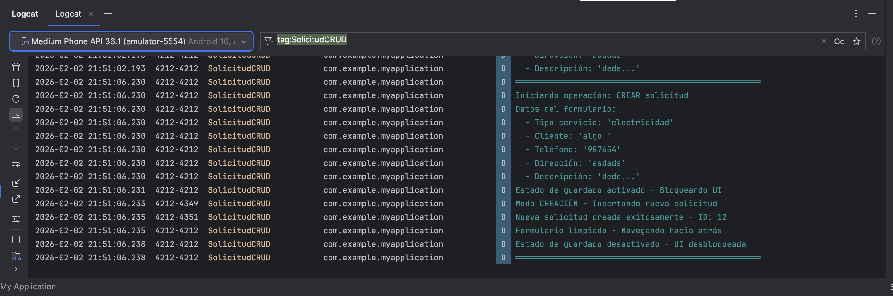
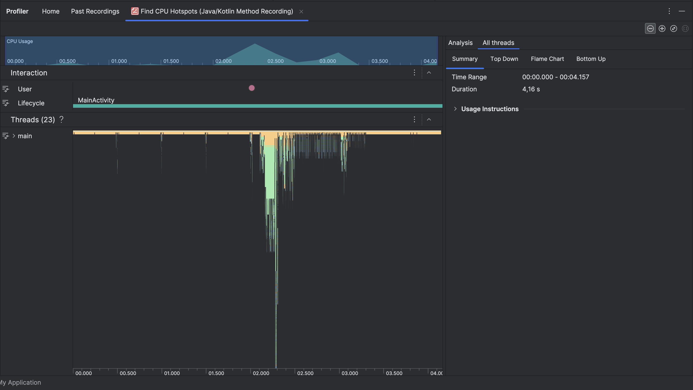
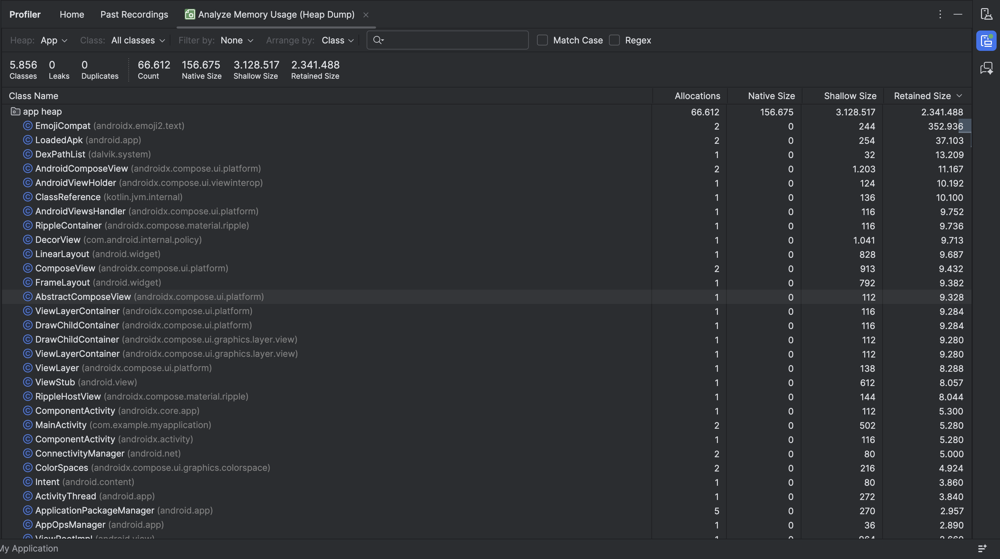

# Informe Tecnico - Semana 4
## Diagnosticando Errores y Optimizando el Rendimiento de la Aplicacion Android

**Curso:** Desarrollo APP Moviles II (PMY2202)
**Estudiante:** Franco Castro
**Fecha:** Febrero 2026
**Aplicacion:** Necesitas Ayuda?

---

## 1. Flujo Critico Seleccionado

Se selecciono el flujo de **guardar solicitud** (`saveSolicitud()`) como flujo critico por las siguientes razones:

1. **Complejidad**: Involucra validacion de datos, operaciones asincronas y acceso a base de datos Room
2. **Impacto en usuario**: Es la operacion principal que permite crear y editar solicitudes de servicio
3. **Puntos de fallo potenciales**:
   - Validacion de campos obligatorios (tipoServicio, nombreCliente, telefono, direccion)
   - Operaciones de I/O con Room Database
   - Manejo de estados concurrentes (evitar guardados duplicados)
   - Transiciones de navegacion post-guardado

---

## 2. Problemas Identificados Durante la Depuracion

### 2.1 Manejo Generico de Excepciones

**Descripcion:** El codigo original capturaba todas las excepciones con un bloque `catch (e: Exception)` generico.

**Impacto:** Dificultad para diagnosticar problemas especificos, mensajes de error poco utiles para el usuario.

### 2.2 Ausencia de Logging Estructurado

**Descripcion:** No existian logs para rastrear el flujo de ejecucion ni tiempos de operacion.

**Impacto:** Imposibilidad de diagnosticar problemas en produccion.

### 2.3 Falta de Validacion de Estado

**Descripcion:** En modo edicion, no se validaba si la solicitud a editar existia en la base de datos.

**Impacto:** Posible comportamiento inesperado si la solicitud fue eliminada.

---

## 3. Acciones Realizadas

### 3.1 Implementacion de Logging con Logcat

Se implemento un sistema de logging estructurado con TAGs para facilitar el filtrado:

| TAG | Proposito |
|-----|-----------|
| `SolicitudViewModel` | Logs generales del ViewModel |
| `SolicitudCRUD` | Operaciones Create, Read, Update, Delete |
| `SolicitudPerformance` | Metricas de tiempo de ejecucion |
| `SolicitudValidation` | Validacion de datos del formulario |
| `SolicitudDB` | Operaciones en base de datos |
| `SolicitudRepository` | Capa Repository |

**Niveles de Log Utilizados:**
- `Log.d()` (Debug): Inicio de operaciones, datos del formulario
- `Log.i()` (Info): Operaciones exitosas, metricas de rendimiento
- `Log.w()` (Warning): Situaciones anormales pero no criticas
- `Log.e()` (Error): Excepciones y fallos

**Evidencia:** Ver captura `screenshots/logcat_crud.png`



### 3.2 Manejo Estructurado de Excepciones (Try-Catch)

Se implementaron bloques try-catch con excepciones especificas:

| Excepcion | Causa Tipica | Mensaje al Usuario |
|-----------|--------------|-------------------|
| `SQLiteException` | Problemas de BD, espacio, corrupcion | "Error de base de datos: Verifique el espacio disponible" |
| `IllegalStateException` | Solicitud no encontrada | Mensaje especifico del error |
| `IOException` | Problemas de almacenamiento | "Error de almacenamiento: Verifique los permisos" |
| `IllegalArgumentException` | Argumentos invalidos | "Estado no valido" |

**Ejemplo implementado en SolicitudViewModel.kt:**
```kotlin
try {
    // operacion de base de datos
} catch (e: SQLiteException) {
    Log.e(TAG_CRUD, "Error de base de datos: ${e.message}", e)
    _uiEvent.emit(UiEvent.ShowToast("Error de base de datos: Verifique el espacio disponible."))
} catch (e: IllegalStateException) {
    Log.e(TAG_CRUD, "Estado ilegal: ${e.message}", e)
    _uiEvent.emit(UiEvent.ShowToast("Error: ${e.message}"))
} catch (e: IOException) {
    Log.e(TAG_CRUD, "Error de I/O: ${e.message}", e)
    _uiEvent.emit(UiEvent.ShowToast("Error de almacenamiento: Verifique los permisos."))
}
```

### 3.3 Metricas de Rendimiento

Se implementaron mediciones de tiempo en operaciones criticas:

```kotlin
val startTime = System.currentTimeMillis()
// operacion
val operationTime = System.currentTimeMillis() - startTime
Log.i(TAG_PERF, "Operacion completada en ${operationTime}ms")
```

---

## 4. Analisis de Rendimiento con Herramientas de Profiling

### 4.1 CPU Profiler

Se utilizo **Find CPU Hotspots (Java/Kotlin Method Recording)** para analizar el consumo de CPU durante la operacion de guardar solicitud.

**Hallazgos:**
- El main thread muestra actividad durante las operaciones de UI
- Las operaciones de base de datos se ejecutan correctamente en Dispatchers.IO
- No se detectaron bloqueos del hilo principal

**Evidencia:** Ver captura `screenshots/profiler_cpu.png`



### 4.2 Memory Profiler

Se utilizo **Analyze Memory Usage (Heap Dump)** para analizar el consumo de memoria.

**Hallazgos:**
- 5,856 clases cargadas en memoria
- **0 Memory Leaks detectados**
- 66,612 objetos en memoria
- 2.34 MB de memoria retenida
- Componentes de Jetpack Compose funcionando correctamente

**Evidencia:** Ver captura `screenshots/profiler_memory.png`



---

## 5. Archivos Modificados

| Archivo | Modificaciones |
|---------|----------------|
| `SolicitudViewModel.kt` | TAGs de logging, try-catch especificos, metricas de tiempo |
| `SolicitudRepository.kt` | TAGs de logging, medicion de tiempos en operaciones BD |

---

## 6. Reflexion sobre el Impacto de las Correcciones

### Impacto en Estabilidad
- El manejo de excepciones especificas permite identificar rapidamente la causa raiz de problemas
- La validacion de estado previa previene errores silenciosos

### Impacto en Eficiencia
- Las metricas de rendimiento permiten identificar cuellos de botella
- El Memory Profiler confirmo que no hay fugas de memoria (0 Leaks)

### Impacto en Mantenibilidad
- Los TAGs descriptivos facilitan la depuracion
- Los mensajes de error contextualizados mejoran la experiencia de soporte
- Los logs actuan como documentacion viva del flujo de la aplicacion

---

## 7. Conclusiones

La implementacion de debugging y monitoreo de rendimiento mejora significativamente la calidad de la aplicacion:

- **6 TAGs de Logcat** para categorizar eventos
- **4 tipos de excepciones** manejadas especificamente
- **Metricas de tiempo** en operaciones criticas
- **0 memory leaks** confirmado con Memory Profiler

Estas mejoras facilitan el desarrollo, depuracion y mantenimiento de la aplicacion.

---

*Documento generado como parte de la entrega de la Semana 4 del curso PMY2202*
