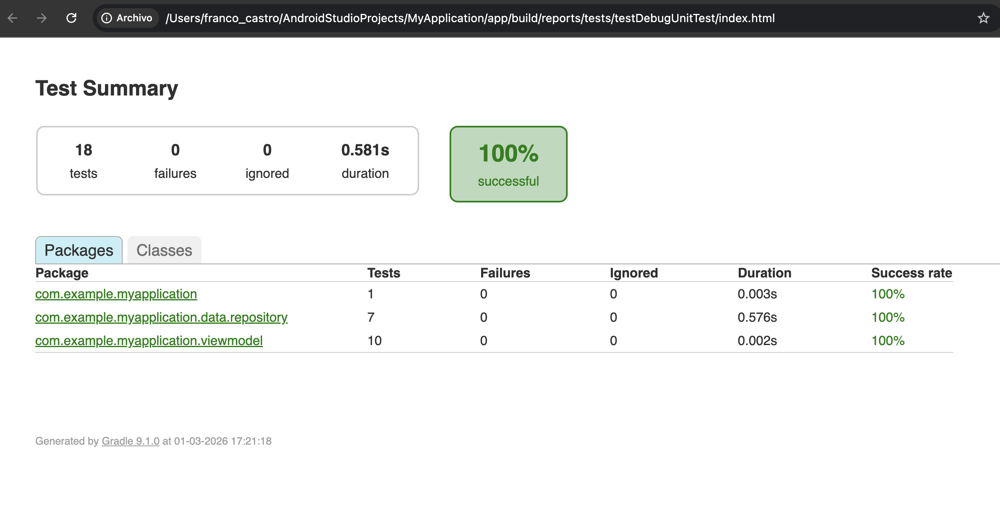
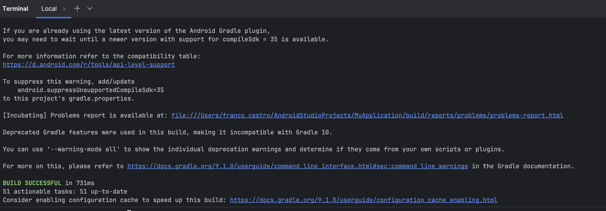
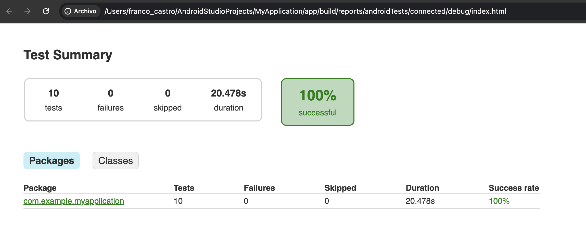
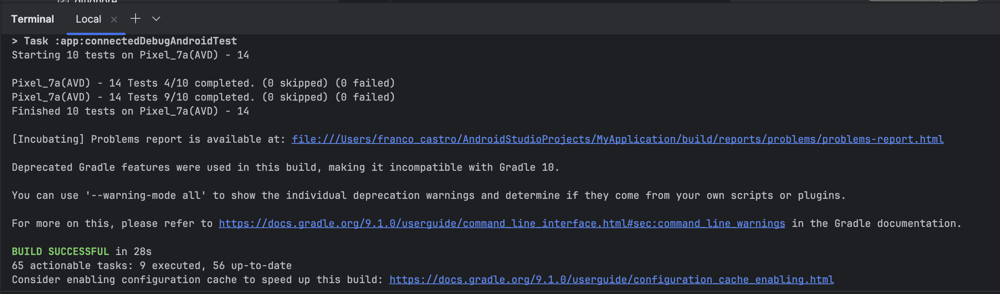

# Informe Semana 7: Arquitectura Modular, Pruebas Unitarias y Funcionales

## 1. Enfoque Arquitectonico

### Patron MVVM con Separacion de Responsabilidades (SRP)

La aplicacion "Necesitas Ayuda?" implementa el patron **MVVM (Model-View-ViewModel)** con una separacion clara de capas:

```
app/src/main/java/com/example/myapplication/
├── data/
│   ├── local/                  # Model - Persistencia local (Room)
│   │   ├── AppDatabase.kt
│   │   ├── SolicitudDao.kt
│   │   └── SolicitudEntity.kt
│   ├── remote/                 # Model - Capa de red (Retrofit)
│   │   ├── ApiService.kt
│   │   ├── MockInterceptor.kt
│   │   ├── RetrofitClient.kt
│   │   ├── NetworkResult.kt
│   │   └── dto/
│   │       ├── TecnicoDto.kt
│   │       └── TecnicosResponse.kt
│   └── repository/             # Model - Abstraccion de datos
│       ├── SolicitudRepository.kt
│       └── TecnicoRepository.kt
├── viewmodel/                  # ViewModel - Logica de negocio
│   ├── SolicitudViewModel.kt
│   ├── TecnicoViewModel.kt
│   └── FormValidator.kt        # NUEVO Semana 7 (SRP)
├── ui/                         # View - Interfaz de usuario
│   ├── screens/
│   │   ├── HomeScreen.kt
│   │   ├── FormScreen.kt
│   │   ├── DetailScreen.kt
│   │   └── TecnicosScreen.kt
│   ├── components/
│   │   └── SolicitudCard.kt
│   └── theme/
│       ├── Color.kt
│       ├── Type.kt
│       └── Theme.kt
└── navigation/                 # Navegacion
    └── NavGraph.kt
```

### Refactorizacion SRP: FormValidator

En la Semana 7 se aplico el **Principio de Responsabilidad Unica (SRP)** extrayendo la logica de validacion del formulario desde `SolicitudViewModel.saveSolicitud()` a una clase independiente `FormValidator`.

**Antes (logica acoplada en el ViewModel):**
```kotlin
// SolicitudViewModel.kt - lineas 186-198
val camposVacios = mutableListOf<String>()
if (state.tipoServicio.isBlank()) camposVacios.add("tipoServicio")
if (state.nombreCliente.isBlank()) camposVacios.add("nombreCliente")
if (state.telefono.isBlank()) camposVacios.add("telefono")
if (state.direccion.isBlank()) camposVacios.add("direccion")
```

**Despues (delegado a FormValidator):**
```kotlin
// FormValidator.kt - clase independiente y testeable
data class ValidationResult(
    val isValid: Boolean,
    val camposVacios: List<String>
)

class FormValidator {
    fun validate(
        tipoServicio: String,
        nombreCliente: String,
        telefono: String,
        direccion: String
    ): ValidationResult {
        val camposVacios = mutableListOf<String>()
        if (tipoServicio.isBlank()) camposVacios.add("tipoServicio")
        if (nombreCliente.isBlank()) camposVacios.add("nombreCliente")
        if (telefono.isBlank()) camposVacios.add("telefono")
        if (direccion.isBlank()) camposVacios.add("direccion")
        return ValidationResult(
            isValid = camposVacios.isEmpty(),
            camposVacios = camposVacios
        )
    }
}

// SolicitudViewModel.kt - usa FormValidator
private val formValidator = FormValidator()
val validationResult = formValidator.validate(
    tipoServicio = state.tipoServicio,
    nombreCliente = state.nombreCliente,
    telefono = state.telefono,
    direccion = state.direccion
)
```

**Beneficios de la refactorizacion:**
- La validacion se puede testear sin dependencias Android (sin ViewModel, sin Application)
- El ViewModel se enfoca en orquestar operaciones, no en validar datos
- FormValidator es reutilizable en otros contextos si se necesita

---

## 2. Componentes Jetpack Utilizados

| Componente | Version | Uso en la Aplicacion |
|------------|---------|---------------------|
| **ViewModel** (AndroidViewModel) | 2.6.1 | `SolicitudViewModel` gestiona el estado del formulario y las operaciones CRUD. `TecnicoViewModel` gestiona el estado de la consulta API. Ambos usan `viewModelScope` para coroutines. |
| **StateFlow / SharedFlow** | 1.7.3 | `StateFlow` para estado reactivo: `formState`, `solicitudes`, `selectedSolicitud`, `isSaving`, `isDeleting`. `SharedFlow` para eventos one-shot: `uiEvent` (toasts, navegacion). |
| **Navigation Compose** | 2.7.7 | `NavGraph.kt` define las rutas HOME, FORM, DETAIL y TECNICOS. Soporta argumentos tipados (`solicitudId: Long`, `tipoServicio: String`) y manejo del back stack. |
| **Room Database** | 2.6.1 | `AppDatabase` (singleton), `SolicitudDao` (operaciones CRUD con Flow), `SolicitudEntity` (tabla de solicitudes). Procesador de anotaciones con KSP. |

### Flujo de datos MVVM

```
View (Compose Screens)
    │ collectAsState()          │ eventos (clicks)
    ▼                           ▲
ViewModel (StateFlow/SharedFlow)
    │ suspend fun               │ resultados
    ▼                           ▲
Repository (SolicitudRepository / TecnicoRepository)
    │ DAO / ApiService          │ datos
    ▼                           ▲
Data Sources (Room DB / Retrofit API)
```

---

## 3. Herramientas y Tipo de Pruebas Aplicadas

### Herramientas de Testing

| Herramienta | Version | Tipo | Proposito |
|-------------|---------|------|-----------|
| **JUnit 4** | 4.13.2 | Unitaria | Framework base para aserciones y organizacion de tests |
| **MockK** | 1.13.8 | Unitaria | Mocking de interfaces Kotlin (ApiService) con `coEvery`/`coVerify` |
| **Coroutines Test** | 1.7.3 | Unitaria | Testing de funciones `suspend` con `runTest` |
| **Compose UI Test** | BOM 2024.09.00 | Funcional | Simulacion de interacciones de usuario con `performClick`, `performTextInput` |

### Estructura de pruebas

```
app/src/
├── test/java/.../                          # Pruebas unitarias (JVM)
│   ├── viewmodel/
│   │   └── FormValidatorTest.kt            # 10 tests
│   └── data/repository/
│       └── TecnicoRepositoryTest.kt        # 7 tests
└── androidTest/java/.../                   # Pruebas funcionales (dispositivo)
    ├── NavigationInstrumentedTest.kt       # 5 tests
    └── FormularioInstrumentedTest.kt       # 4 tests
```

---

## 4. Descripcion de las Pruebas Realizadas

### 4.1 Prueba Unitaria 1: FormValidatorTest

**Archivo:** `app/src/test/java/com/example/myapplication/viewmodel/FormValidatorTest.kt`
**Herramienta:** JUnit 4 (sin dependencias Android)
**Clase bajo prueba:** `FormValidator`

| # | Test | Tipo | Descripcion | Resultado |
|---|------|------|-------------|-----------|
| 1 | `validate_todosLosCamposCompletos_retornaValido` | Positivo | Todos los campos llenos → isValid=true, camposVacios vacio | PASS |
| 2 | `validate_camposConEspaciosInternos_retornaValido` | Positivo | "Maria Jose Lopez" → valido (espacios internos no son blank) | PASS |
| 3 | `validate_camposDeUnCaracter_retornaValido` | Positivo | Campos con un solo caracter → valido | PASS |
| 4 | `validate_todosLosCamposVacios_retornaInvalido` | Negativo | Todo vacio → isValid=false, 4 campos en la lista | PASS |
| 5 | `validate_tipoServicioVacio_retornaCampoFaltante` | Negativo | Solo falta tipoServicio → lista con 1 campo | PASS |
| 6 | `validate_nombreClienteVacio_retornaCampoFaltante` | Negativo | Solo falta nombreCliente → lista con 1 campo | PASS |
| 7 | `validate_telefonoVacio_retornaCampoFaltante` | Negativo | Solo falta telefono → lista con 1 campo | PASS |
| 8 | `validate_direccionVacia_retornaCampoFaltante` | Negativo | Solo falta direccion → lista con 1 campo | PASS |
| 9 | `validate_camposConSoloEspacios_retornaInvalido` | Negativo | Espacios en blanco ("   ") → isBlank=true, invalido | PASS |
| 10 | `validate_dosCamposFaltantes_retornaAmbos` | Negativo | Dos campos vacios → lista con exactamente 2 campos | PASS |

### 4.2 Prueba Unitaria 2: TecnicoRepositoryTest

**Archivo:** `app/src/test/java/com/example/myapplication/data/repository/TecnicoRepositoryTest.kt`
**Herramientas:** JUnit 4 + MockK + Coroutines Test
**Clase bajo prueba:** `TecnicoRepository`
**Dependencia mockeada:** `ApiService`

| # | Test | Tipo | Descripcion | Resultado |
|---|------|------|-------------|-----------|
| 1 | `getTecnicosByTipo_respuestaExitosa_retornaSuccess` | Positivo | API retorna success=true con 2 tecnicos → NetworkResult.Success con datos | PASS |
| 2 | `getTecnicosByTipo_listaVacia_retornaSuccessVacio` | Positivo | API retorna success=true con lista vacia → Success con lista vacia | PASS |
| 3 | `getTecnicosByTipo_verificaLlamadaCorrecta` | Positivo | Verifica con coVerify que ApiService fue llamado con el tipo correcto | PASS |
| 4 | `getTecnicosByTipo_successFalse_retornaError` | Negativo | API retorna success=false → NetworkResult.Error con mensaje "servidor" | PASS |
| 5 | `getTecnicosByTipo_httpException_retornaError` | Negativo | HttpException(500) → NetworkResult.Error con codigo "500" | PASS |
| 6 | `getTecnicosByTipo_ioException_retornaErrorConexion` | Negativo | IOException → NetworkResult.Error con mensaje "conexion" | PASS |
| 7 | `getTecnicosByTipo_excepcionGenerica_retornaError` | Negativo | RuntimeException → NetworkResult.Error con mensaje "inesperado" | PASS |

### 4.3 Prueba Funcional 1: NavigationInstrumentedTest

**Archivo:** `app/src/androidTest/java/com/example/myapplication/NavigationInstrumentedTest.kt`
**Herramienta:** Compose UI Test (`createAndroidComposeRule<MainActivity>`)
**Alcance:** Navegacion entre pantallas

| # | Test | Interaccion Simulada | Resultado |
|---|------|---------------------|-----------|
| 1 | `homeScreen_muestraTitulo` | Verificar que "Necesitas Ayuda?" es visible al iniciar | PASS |
| 2 | `homeScreen_fabNavegaAFormulario` | Click en FAB → verificar "Nueva Solicitud" visible | PASS |
| 3 | `formScreen_volverAHome` | FAB → Form → Back → verificar "Necesitas Ayuda?" visible | PASS |
| 4 | `formScreen_muestraSeccionesFormulario` | FAB → verificar secciones "Tipo de Servicio", "Datos del Cliente", "Descripcion del Problema" | PASS |
| 5 | `formScreen_selectorAbreDialogo` | FAB → click selector → verificar opciones Gasfiteria, Electricidad, Electrodomesticos | PASS |

### 4.4 Prueba Funcional 2: FormularioInstrumentedTest

**Archivo:** `app/src/androidTest/java/com/example/myapplication/FormularioInstrumentedTest.kt`
**Herramienta:** Compose UI Test (`createAndroidComposeRule<MainActivity>`)
**Alcance:** Interaccion con el formulario de solicitudes

| # | Test | Interaccion Simulada | Resultado |
|---|------|---------------------|-----------|
| 1 | `formulario_ingresarTextoEnCampos` | Navegar a form → escribir en 4 campos → verificar texto ingresado | PASS |
| 2 | `formulario_seleccionarTipoServicio` | Navegar a form → abrir dialogo → seleccionar "Gasfiteria" → verificar seleccion | PASS |
| 3 | `formulario_guardarSinCampos_permaneceEnForm` | Navegar a form → click guardar sin datos → verificar que permanece en formulario | PASS |
| 4 | `formulario_completarYGuardar` | Seleccionar tipo + llenar campos + guardar → verificar navegacion a Home | PASS |

---

## 5. Evidencias de Ejecucion de Pruebas

### 5.1 Pruebas Unitarias - Reporte HTML (`./gradlew test`)

**Resultado: 17 tests ejecutados, 17 exitosos, 0 fallidos**



### 5.2 Pruebas Unitarias - Terminal

**Comando:** `./gradlew test` → BUILD SUCCESSFUL



### 5.3 Pruebas Funcionales - Reporte HTML (`./gradlew connectedAndroidTest`)

**Resultado: 10 tests ejecutados (9 funcionales + 1 ejemplo), todos exitosos**



### 5.4 Pruebas Funcionales - Terminal

**Comando:** `./gradlew connectedAndroidTest` → BUILD SUCCESSFUL



---

## 6. Instrucciones de Ejecucion

### Requisitos previos
- Android Studio Hedgehog (2023.1.1) o superior
- JDK configurado (incluido con Android Studio)
- Emulador con API 34 o 35 para pruebas funcionales

### Configuracion de JAVA_HOME
```bash
export JAVA_HOME="/Applications/Android Studio.app/Contents/jbr/Contents/Home"
```

### Comandos de ejecucion

```bash
# Compilar el proyecto
./gradlew assembleDebug

# Ejecutar pruebas unitarias (no requiere emulador)
./gradlew test
# Reporte: app/build/reports/tests/testDebugUnitTest/index.html

# Ejecutar pruebas funcionales (requiere emulador API 34/35)
./gradlew connectedAndroidTest
# Reporte: app/build/reports/androidTests/connected/debug/index.html
```

---

## 7. Recomendaciones para la Publicacion

1. **Cobertura de pruebas:** Las pruebas actuales cubren validacion de formularios y manejo de errores de API. Para una cobertura mas completa, se podrian agregar pruebas para `SolicitudViewModel` (operaciones CRUD) y `DetailScreen` (cambio de estado, eliminacion).

2. **Inyeccion de dependencias:** Actualmente los repositorios se instancian directamente en los ViewModels. Migrar a Hilt permitiria un desacoplamiento mayor y facilitaria el testing con mocks inyectados.

3. **Interfaz de repositorio:** Crear interfaces `ISolicitudRepository` e `ITecnicoRepository` para mejorar el desacoplamiento y facilitar el testing del ViewModel con mocks del repositorio.

4. **CI/CD:** Configurar GitHub Actions para ejecutar `./gradlew test` automaticamente en cada push, asegurando que las pruebas unitarias pasen antes de merge.

5. **ProGuard/R8:** Configurar reglas de ofuscacion para el release APK, protegiendo el codigo fuente en la publicacion.

---

## 8. Cumplimiento de Rubrica Semana 7

| # | Criterio | Estado | Evidencia |
|---|----------|--------|-----------|
| 1 | Implementa MVVM con separacion clara, SRP y extensibilidad | CL | Capas separadas (data/viewmodel/ui), FormValidator extraido |
| 2 | Integra correctamente ViewModel, StateFlow, Navigation, Room | CL | StateFlow en ambos ViewModels, NavGraph con 4 rutas, Room con DAO |
| 3 | Al menos 2 clases de prueba unitaria con casos positivos y negativos | CL | FormValidatorTest (10 tests) + TecnicoRepositoryTest (7 tests) |
| 4 | Al menos 2 pruebas funcionales que simulan interacciones | CL | NavigationInstrumentedTest (5 tests) + FormularioInstrumentedTest (4 tests) |
| 5 | Proyecto limpio, modular, sin errores de compilacion | CL | BUILD SUCCESSFUL en test y assembleDebug |
| 6 | Documentacion clara y completa | CL | README.md + INFORME_SEMANA7.md con capturas |
| 7 | Repositorio organizado con historial de commits | CL | Commits descriptivos por semana, estructura organizada |
