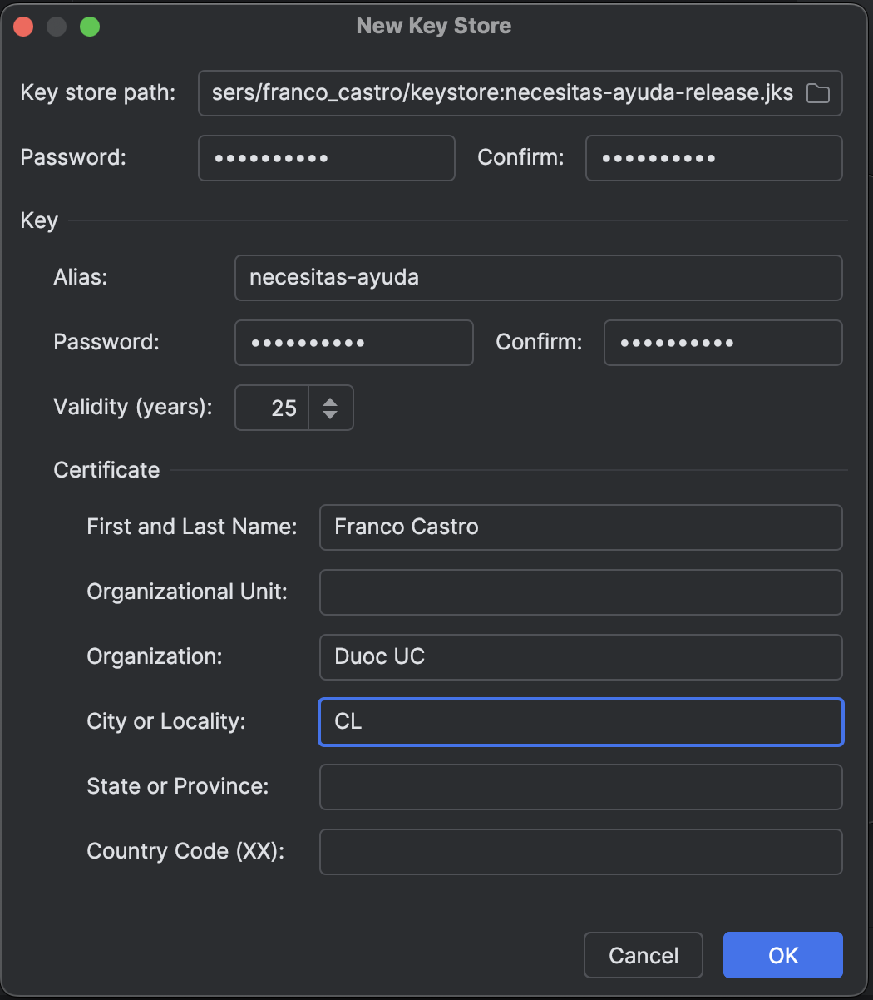
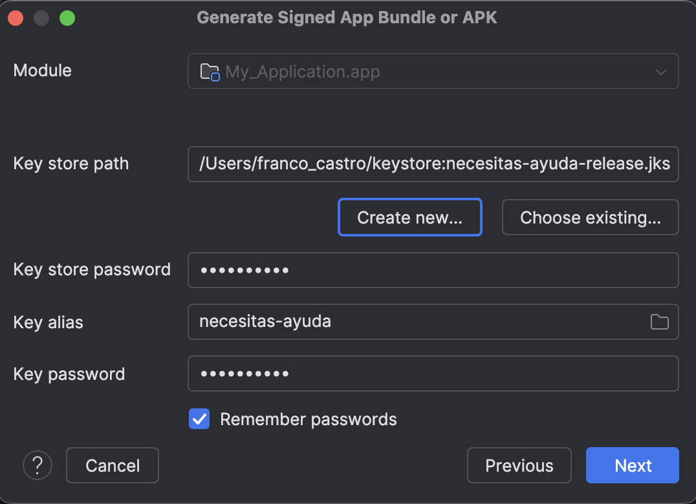

# Informe Semana 8: Validando y Publicando tu Aplicacion Android

## 1. Arquitectura MVVM Implementada

### Patron MVVM con Separacion de Responsabilidades

La aplicacion "Necesitas Ayuda?" implementa el patron **MVVM (Model-View-ViewModel)** con separacion clara de capas y aplicacion del principio SRP:

```
app/src/main/java/com/example/myapplication/
├── data/
│   ├── local/                  # Model - Persistencia local (Room)
│   │   ├── AppDatabase.kt
│   │   ├── SolicitudDao.kt
│   │   └── SolicitudEntity.kt
│   ├── remote/                 # Model - Capa de red (Retrofit)
│   │   ├── ApiService.kt
│   │   ├── MockInterceptor.kt
│   │   ├── RetrofitClient.kt
│   │   ├── NetworkResult.kt
│   │   └── dto/
│   │       ├── TecnicoDto.kt
│   │       └── TecnicosResponse.kt
│   └── repository/             # Model - Abstraccion de datos
│       ├── SolicitudRepository.kt
│       └── TecnicoRepository.kt
├── viewmodel/                  # ViewModel - Logica de negocio
│   ├── SolicitudViewModel.kt
│   ├── TecnicoViewModel.kt
│   └── FormValidator.kt        # SRP: Validacion extraida del ViewModel
├── ui/                         # View - Interfaz de usuario
│   ├── screens/
│   │   ├── HomeScreen.kt
│   │   ├── FormScreen.kt
│   │   ├── DetailScreen.kt
│   │   └── TecnicosScreen.kt
│   ├── components/
│   │   └── SolicitudCard.kt
│   └── theme/
│       ├── Color.kt
│       ├── Type.kt
│       └── Theme.kt
└── navigation/                 # Navegacion
    └── NavGraph.kt
```

### Flujo de datos MVVM

```
View (Compose Screens)
    │ collectAsState()          │ eventos (clicks)
    ▼                           ▲
ViewModel (StateFlow/SharedFlow)
    │ suspend fun               │ resultados
    ▼                           ▲
Repository (SolicitudRepository / TecnicoRepository)
    │ DAO / ApiService          │ datos
    ▼                           ▲
Data Sources (Room DB / Retrofit API)
```

### Componentes Jetpack Utilizados

| Componente | Version | Uso en la Aplicacion |
|------------|---------|---------------------|
| **ViewModel** (AndroidViewModel) | 2.6.1 | Gestion de estado con `viewModelScope` para coroutines |
| **StateFlow / SharedFlow** | 1.7.3 | Estado reactivo (`formState`, `solicitudes`, `isSaving`) y eventos one-shot (`uiEvent`) |
| **Navigation Compose** | 2.7.7 | 4 rutas (Home, Form, Detail, Tecnicos) con argumentos tipados |
| **Room Database** | 2.6.1 | Persistencia local con Entity, DAO (Flow) y singleton Database |

---

## 2. Pruebas Automatizadas

### Resumen de Pruebas

| Tipo | Clase | Tests | Herramientas | Resultado |
|------|-------|-------|-------------|-----------|
| Unitaria | FormValidatorTest | 10 | JUnit 4 | 10/10 PASS |
| Unitaria | TecnicoRepositoryTest | 7 | JUnit 4 + MockK + Coroutines Test | 7/7 PASS |
| Funcional | NavigationInstrumentedTest | 5 | Compose UI Test | 5/5 PASS |
| Funcional | FormularioInstrumentedTest | 4 | Compose UI Test | 4/4 PASS |
| **Total** | **4 clases** | **26** | | **26/26 PASS** |

### Pruebas Unitarias (17 tests)

Ejecutadas en JVM local sin necesidad de emulador:

**FormValidatorTest (10 tests)** - Valida la logica de formulario extraida con SRP:

| # | Test | Tipo | Descripcion |
|---|------|------|-------------|
| 1 | `validate_todosLosCamposCompletos_retornaValido` | Positivo | Todos llenos → valido |
| 2 | `validate_camposConEspaciosInternos_retornaValido` | Positivo | "Maria Jose Lopez" → valido |
| 3 | `validate_camposDeUnCaracter_retornaValido` | Positivo | Campos minimos → valido |
| 4 | `validate_todosLosCamposVacios_retornaInvalido` | Negativo | Todo vacio → 4 campos faltantes |
| 5 | `validate_tipoServicioVacio_retornaCampoFaltante` | Negativo | Solo falta tipoServicio |
| 6 | `validate_nombreClienteVacio_retornaCampoFaltante` | Negativo | Solo falta nombreCliente |
| 7 | `validate_telefonoVacio_retornaCampoFaltante` | Negativo | Solo falta telefono |
| 8 | `validate_direccionVacia_retornaCampoFaltante` | Negativo | Solo falta direccion |
| 9 | `validate_camposConSoloEspacios_retornaInvalido` | Negativo | Espacios en blanco → invalido |
| 10 | `validate_dosCamposFaltantes_retornaAmbos` | Negativo | Dos vacios → lista con 2 |

**TecnicoRepositoryTest (7 tests)** - Valida la capa de red con MockK:

| # | Test | Tipo | Descripcion |
|---|------|------|-------------|
| 1 | `getTecnicosByTipo_respuestaExitosa_retornaSuccess` | Positivo | API ok → Success con datos |
| 2 | `getTecnicosByTipo_listaVacia_retornaSuccessVacio` | Positivo | Lista vacia → Success([]) |
| 3 | `getTecnicosByTipo_verificaLlamadaCorrecta` | Positivo | Verifica llamada con tipo correcto |
| 4 | `getTecnicosByTipo_successFalse_retornaError` | Negativo | success=false → Error |
| 5 | `getTecnicosByTipo_httpException_retornaError` | Negativo | HttpException(500) → Error |
| 6 | `getTecnicosByTipo_ioException_retornaErrorConexion` | Negativo | IOException → Error conexion |
| 7 | `getTecnicosByTipo_excepcionGenerica_retornaError` | Negativo | RuntimeException → Error inesperado |

### Pruebas Funcionales (9 tests)

Ejecutadas en emulador con Compose UI Test, simulando interacciones reales del usuario:

**NavigationInstrumentedTest (5 tests):**

| # | Test | Interaccion Simulada |
|---|------|---------------------|
| 1 | `homeScreen_muestraTitulo` | Verificar "Necesitas Ayuda?" visible al iniciar |
| 2 | `homeScreen_fabNavegaAFormulario` | Click FAB → "Nueva Solicitud" visible |
| 3 | `formScreen_volverAHome` | FAB → Form → Back → Home visible |
| 4 | `formScreen_muestraSeccionesFormulario` | FAB → verificar secciones del formulario |
| 5 | `formScreen_selectorAbreDialogo` | FAB → click selector → opciones visibles |

**FormularioInstrumentedTest (4 tests):**

| # | Test | Interaccion Simulada |
|---|------|---------------------|
| 1 | `formulario_ingresarTextoEnCampos` | Escribir en campos → verificar texto |
| 2 | `formulario_seleccionarTipoServicio` | Abrir dialogo → seleccionar → verificar |
| 3 | `formulario_guardarSinCampos_permaneceEnForm` | Guardar sin datos → permanece en form |
| 4 | `formulario_completarYGuardar` | Llenar todo → guardar → navega a home |

### Compose UI Test vs Espresso

Las pruebas funcionales utilizan **Compose UI Test** en lugar de Espresso tradicional. Compose UI Test es el framework oficial de Google para aplicaciones desarrolladas con Jetpack Compose:

| Aspecto | Espresso (Views) | Compose UI Test (Compose) |
|---------|-------------------|---------------------------|
| Target | Android Views (XML layouts) | Jetpack Compose UI |
| Localizacion | `onView(withId(R.id.xxx))` | `onNodeWithTag("xxx")` / `onNodeWithText("xxx")` |
| Interaccion | `perform(click())` | `performClick()` |
| Verificacion | `check(matches(isDisplayed()))` | `assertIsDisplayed()` |
| Dependencia | `androidx.test.espresso` | `androidx.compose.ui.test` |

Ambos frameworks ejecutan pruebas instrumentadas en un dispositivo/emulador real y validan la interaccion del usuario con la interfaz. Compose UI Test es el equivalente directo de Espresso para aplicaciones Compose.

---

## 3. Configuracion para Publicacion

### Permiso INTERNET

Se agrego el permiso `INTERNET` en `AndroidManifest.xml`, requerido por Retrofit para comunicacion de red:

```xml
<uses-permission android:name="android.permission.INTERNET" />
```

Sin este permiso, las llamadas de red a traves de OkHttp/Retrofit fallarian con `SecurityException`.

### Versionado

Se actualizo el versionado en `app/build.gradle.kts`:

| Campo | Valor anterior | Valor actual | Significado |
|-------|---------------|--------------|-------------|
| `versionCode` | 1 | 8 | Version interna (Semana 8), requerido por Google Play para cada actualizacion |
| `versionName` | "1.0" | "1.0.0" | Version visible al usuario, formato semantico (major.minor.patch) |

```kotlin
defaultConfig {
    applicationId = "com.example.myapplication"
    minSdk = 25
    targetSdk = 35
    versionCode = 8
    versionName = "1.0.0"
}
```

### Generacion de APK Firmado

El APK firmado garantiza la **integridad** y **autenticidad** de la aplicacion, verificando que no ha sido modificada despues de la firma.

**Proceso en Android Studio:**

1. Build > Generate Signed Bundle / APK...
2. Seleccionar APK > Next
3. Crear keystore: `keystore/necesitas-ayuda-release.jks`
4. Configurar alias: `necesitas-ayuda`, org: Duoc UC, country: CL
5. Seleccionar release con V1 (JAR Signature) + V2 (Full APK Signature)
6. APK resultante copiado a `apk/app-release.apk`

**Esquemas de firma:**
- **V1 (JAR Signature):** Compatible con todas las versiones de Android
- **V2 (Full APK Signature):** Verificacion mas rapida, protege todo el contenido del APK

---

## 4. Evidencias

### 4.1 Creacion del Keystore

Dialogo de creacion del keystore con los datos de firma:



### 4.2 Generacion del APK Firmado

Dialogo de Build > Generate Signed APK en Android Studio:



### 4.3 Ejecucion de Pruebas

**Pruebas unitarias (17/17 PASS):**


**Pruebas funcionales (9/9 PASS):**


---

## 5. Estructura de Entregables

```
MyApplication/
├── apk/
│   ├── app-debug.apk                             # APK debug
│   └── app-release.apk                           # APK firmado release
├── app/src/main/
│   ├── AndroidManifest.xml                        # Permiso INTERNET
│   └── java/com/example/myapplication/
│       ├── MainActivity.kt
│       ├── MemoryLeakDemo.kt
│       ├── data/
│       │   ├── local/                             # Room Database
│       │   ├── remote/                            # Retrofit + MockInterceptor
│       │   └── repository/                        # Repositorios
│       ├── viewmodel/
│       │   ├── SolicitudViewModel.kt
│       │   ├── TecnicoViewModel.kt
│       │   └── FormValidator.kt                   # Validacion SRP
│       ├── navigation/NavGraph.kt
│       └── ui/screens/                            # 4 pantallas Compose
├── app/src/test/java/.../                          # 17 pruebas unitarias
│   ├── viewmodel/FormValidatorTest.kt             # 10 tests
│   └── data/repository/TecnicoRepositoryTest.kt   # 7 tests
├── app/src/androidTest/java/.../                   # 9 pruebas funcionales
│   ├── NavigationInstrumentedTest.kt              # 5 tests
│   └── FormularioInstrumentedTest.kt              # 4 tests
├── docs/
│   ├── INFORME_SEMANA4_DEBUGGING_OPTIMIZACION.md
│   ├── INFORME_SEMANA5_MEMORY_LEAKS.md
│   ├── INFORME_SEMANA6_LIBRERIAS_EXTERNAS.md
│   ├── INFORME_SEMANA7.md
│   ├── INFORME_SEMANA8.md                         # Este informe
│   └── screenshots/
│       ├── semana6/
│       ├── semana7/
│       └── semana8/
│           ├── evidencia_key_store.png
│           └── evidencia_crear_app.png
├── app/build.gradle.kts                           # versionCode=8, versionName=1.0.0
├── .gitignore                                     # *.jks, *.keystore excluidos
└── README.md                                      # Documentacion completa Semanas 2-8
```

---

## 6. Instrucciones de Compilacion y Pruebas

### Requisitos previos
- Android Studio Hedgehog (2023.1.1) o superior
- JDK incluido con Android Studio
- Emulador API 34/35 para pruebas funcionales

### Comandos

```bash
# Configurar JAVA_HOME
export JAVA_HOME="/Applications/Android Studio.app/Contents/jbr/Contents/Home"

# Compilar release
./gradlew assembleRelease

# Ejecutar pruebas unitarias (17 tests)
./gradlew test
# Reporte: app/build/reports/tests/testDebugUnitTest/index.html

# Ejecutar pruebas funcionales (9 tests, requiere emulador)
./gradlew connectedAndroidTest
# Reporte: app/build/reports/androidTests/connected/debug/index.html
```

---

## 7. Cumplimiento de Rubrica Semana 8

| # | Criterio | Pts | Estado | Evidencia |
|---|----------|-----|--------|-----------|
| 1 | Arquitectura MVVM con SRP | 20 | CL | Capas data/viewmodel/ui separadas, FormValidator extraido |
| 2 | Componentes Jetpack (ViewModel, StateFlow, Navigation, Room) | 15 | CL | Integrados en todas las pantallas |
| 3 | Pruebas unitarias (JUnit + MockK) | 15 | CL | FormValidatorTest (10) + TecnicoRepositoryTest (7) = 17 tests |
| 4 | Pruebas funcionales UI (Compose UI Test) | 15 | CL | NavigationInstrumentedTest (5) + FormularioInstrumentedTest (4) = 9 tests |
| 5 | APK firmado con keystore | 10 | CL | Permiso INTERNET, versionCode=8, firma V1+V2 |
| 6 | README tecnico completo | 15 | CL | README.md documentando Semanas 2-8 con capturas |
| 7 | Entrega GitHub organizada | 10 | CL | .gitignore actualizado, commits descriptivos, repo publico |

---

## 8. Reflexion de Cierre Tecnico

A lo largo de las 8 semanas de desarrollo, la aplicacion "Necesitas Ayuda?" evoluciono desde un CRUD basico con Room hasta una aplicacion completa con:

- **Persistencia local** (Room) con operaciones asincronas (Coroutines)
- **Comunicacion de red** (Retrofit + OkHttp) con datos mock simulando una API real
- **Diagnostico de memoria** (LeakCanary + Android Profiler) con correccion de leaks
- **Pruebas automatizadas** (JUnit, MockK, Compose UI Test) con 26 tests cubriendo validacion, red y UI
- **Publicacion** con APK firmado, permisos correctos y versionado semantico

La arquitectura MVVM permitio mantener el codigo organizado y testeable a medida que crecia la complejidad. La aplicacion del principio SRP con `FormValidator` demostro como la separacion de responsabilidades facilita tanto el mantenimiento como el testing.
