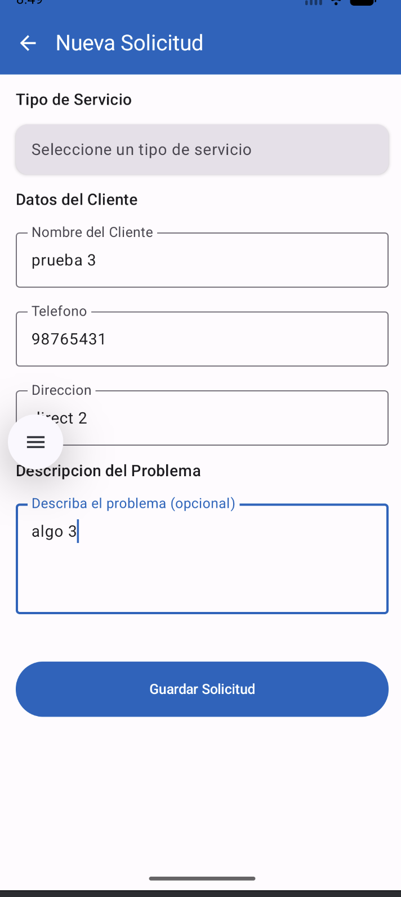
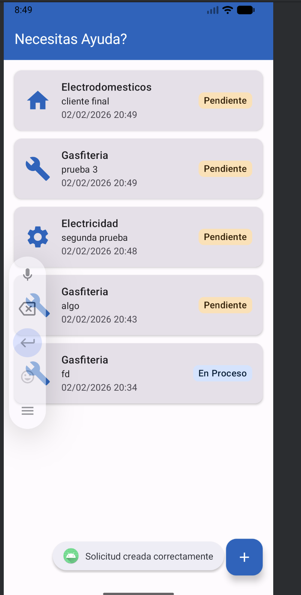
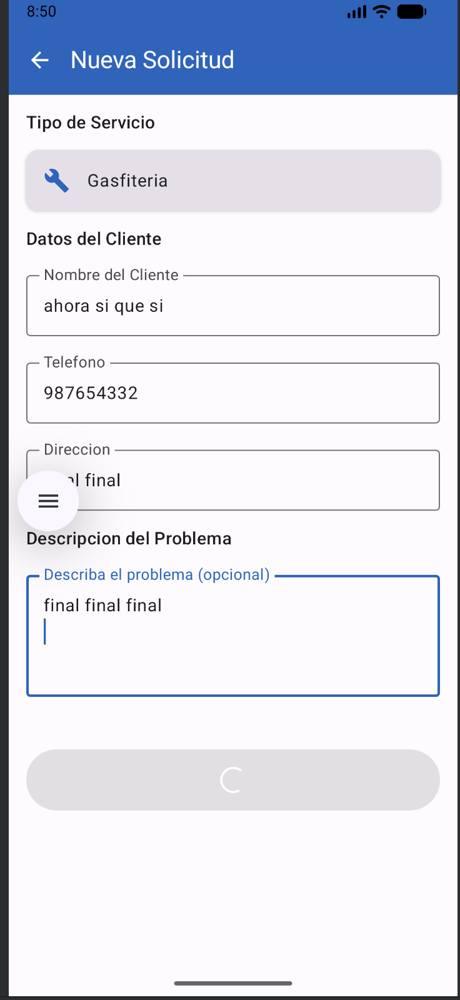
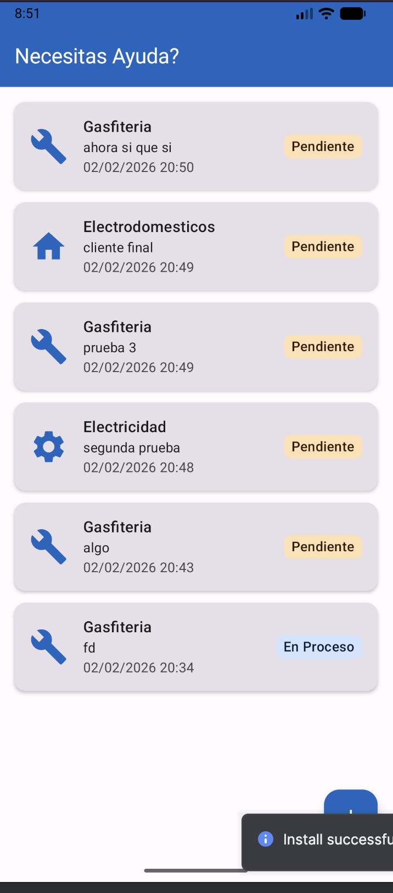

# Informe Semana 3: Optimizacion de Rendimiento con Coroutines

**Curso:** Desarrollo App Moviles II - Duoc UC
**Tema:** Implementacion de Kotlin Coroutines para operaciones asincronas

---

## Paso 1: Flujo Critico Seleccionado

### Descripcion del Flujo

El flujo seleccionado para optimizacion es **Guardar/Editar solicitudes** en FormScreen. Este flujo es critico porque:

1. **Involucra operaciones de base de datos secuenciales**: Al editar, primero se obtiene la solicitud existente (GET) y luego se actualiza (UPDATE)
2. **Impacto directo en UX**: El usuario no recibia feedback visual durante el proceso de guardado
3. **Riesgo de operaciones duplicadas**: Sin control, multiples clicks generaban inserciones duplicadas
4. **Flujo mas utilizado**: Es la operacion principal de la aplicacion

### Codigo ANTES de la Optimizacion

```kotlin
// SolicitudViewModel.kt - Version anterior
fun saveSolicitud() {
    val state = _formState.value

    if (state.tipoServicio.isBlank() || state.nombreCliente.isBlank() ||
        state.telefono.isBlank() || state.direccion.isBlank()) {
        viewModelScope.launch {
            _uiEvent.emit(UiEvent.ShowToast("Por favor complete todos los campos obligatorios"))
        }
        return
    }

    viewModelScope.launch {
        // Sin indicador de carga
        // Sin Dispatchers explicito
        // Sin try-catch para manejo de errores
        if (state.isEditing && state.editingId != null) {
            val existingSolicitud = repository.getSolicitudById(state.editingId)
            val updatedSolicitud = SolicitudEntity(
                id = state.editingId,
                tipoServicio = state.tipoServicio,
                // ... mas campos
            )
            repository.updateSolicitud(updatedSolicitud)
            _uiEvent.emit(UiEvent.ShowToast("Solicitud actualizada correctamente"))
        } else {
            val newSolicitud = SolicitudEntity(/* ... */)
            repository.insertSolicitud(newSolicitud)
            _uiEvent.emit(UiEvent.ShowToast("Solicitud creada correctamente"))
        }
        clearForm()
        _uiEvent.emit(UiEvent.NavigateBack)
    }
}
```

### Problemas Identificados

| Problema | Impacto |
|----------|---------|
| Sin indicador de carga | Usuario no sabe si la app esta procesando |
| Sin prevencion de clicks multiples | Posibles duplicados en BD |
| Sin Dispatchers.IO explicito | Operaciones IO en dispatcher por defecto |
| Sin manejo de errores | App puede crashear sin feedback |

### Capturas ANTES





*Boton "Guardar Solicitud" sin estado de carga - el usuario puede hacer multiples clicks*

---

## Paso 2: Implementacion con Coroutines

### Dependencias Agregadas

```toml
# gradle/libs.versions.toml
kotlinxCoroutines = "1.7.3"

[libraries]
kotlinx-coroutines-android = { group = "org.jetbrains.kotlinx", name = "kotlinx-coroutines-android", version.ref = "kotlinxCoroutines" }
```

```kotlin
// app/build.gradle.kts
implementation(libs.kotlinx.coroutines.android)
```

### Estados de Carga en ViewModel

```kotlin
// SolicitudViewModel.kt - Nuevos estados
private val _isSaving = MutableStateFlow(false)
val isSaving: StateFlow<Boolean> = _isSaving.asStateFlow()

private val _isDeleting = MutableStateFlow(false)
val isDeleting: StateFlow<Boolean> = _isDeleting.asStateFlow()
```

### Funcion saveSolicitud() Optimizada

```kotlin
fun saveSolicitud() {
    val state = _formState.value

    // Validacion sincrona
    if (state.tipoServicio.isBlank() || state.nombreCliente.isBlank() ||
        state.telefono.isBlank() || state.direccion.isBlank()) {
        viewModelScope.launch {
            _uiEvent.emit(UiEvent.ShowToast("Por favor complete todos los campos obligatorios"))
        }
        return
    }

    // Prevenir multiples ejecuciones
    if (_isSaving.value) return

    viewModelScope.launch {
        _isSaving.value = true
        try {
            withContext(Dispatchers.IO) {
                if (state.isEditing && state.editingId != null) {
                    val existingSolicitud = repository.getSolicitudById(state.editingId)
                    val updatedSolicitud = SolicitudEntity(
                        id = state.editingId,
                        tipoServicio = state.tipoServicio,
                        descripcion = state.descripcion,
                        nombreCliente = state.nombreCliente,
                        telefono = state.telefono,
                        direccion = state.direccion,
                        fechaSolicitud = existingSolicitud?.fechaSolicitud ?: System.currentTimeMillis(),
                        estado = existingSolicitud?.estado ?: "pendiente"
                    )
                    repository.updateSolicitud(updatedSolicitud)
                } else {
                    val newSolicitud = SolicitudEntity(
                        tipoServicio = state.tipoServicio,
                        descripcion = state.descripcion,
                        nombreCliente = state.nombreCliente,
                        telefono = state.telefono,
                        direccion = state.direccion
                    )
                    repository.insertSolicitud(newSolicitud)
                }
            }
            val message = if (state.isEditing) "Solicitud actualizada correctamente"
                          else "Solicitud creada correctamente"
            _uiEvent.emit(UiEvent.ShowToast(message))
            clearForm()
            _uiEvent.emit(UiEvent.NavigateBack)
        } catch (e: Exception) {
            _uiEvent.emit(UiEvent.ShowToast("Error al guardar: ${e.localizedMessage}"))
        } finally {
            _isSaving.value = false
        }
    }
}
```

### Explicacion Tecnica

| Elemento | Funcion |
|----------|---------|
| `_isSaving.value = true` | Activa estado de carga antes de iniciar |
| `if (_isSaving.value) return` | Previene ejecuciones duplicadas |
| `withContext(Dispatchers.IO)` | Ejecuta operaciones de BD en hilo de IO |
| `try-catch` | Captura errores y muestra feedback al usuario |
| `finally { _isSaving.value = false }` | Garantiza reset del estado aunque haya error |
| `viewModelScope.launch` | Scope que se cancela automaticamente con el ViewModel |

### UI con Indicador de Carga (FormScreen)

```kotlin
@Composable
fun FormScreen(viewModel: SolicitudViewModel, onNavigateBack: () -> Unit) {
    val formState by viewModel.formState.collectAsState()
    val isSaving by viewModel.isSaving.collectAsState()

    // ... resto del codigo ...

    Button(
        onClick = { viewModel.saveSolicitud() },
        enabled = !isSaving,  // Deshabilitado durante guardado
        modifier = Modifier
            .fillMaxWidth()
            .height(56.dp)
    ) {
        if (isSaving) {
            CircularProgressIndicator(
                modifier = Modifier.size(24.dp),
                color = MaterialTheme.colorScheme.onPrimary,
                strokeWidth = 2.dp
            )
        } else {
            Text(
                text = if (formState.isEditing)
                    stringResource(R.string.btn_actualizar)
                else
                    stringResource(R.string.btn_guardar)
            )
        }
    }
}
```

### Capturas DESPUES





*Boton con CircularProgressIndicator durante el guardado - deshabilitado para prevenir clicks multiples*

---

## Paso 3: Comparacion Coroutines vs RxJava

| Aspecto | Kotlin Coroutines | RxJava |
|---------|-------------------|--------|
| **Sintaxis** | Secuencial con `suspend fun` | Cadenas de operadores (`map`, `flatMap`, `subscribe`) |
| **Curva de aprendizaje** | Baja - similar a codigo sincrono | Alta - requiere entender paradigma reactivo |
| **Integracion Android** | Nativa con Jetpack (Room, ViewModel, Lifecycle) | Requiere librerias adicionales (RxAndroid, RxKotlin) |
| **Manejo de errores** | `try-catch` estandar de Kotlin | `onError` en cadena reactiva |
| **Cancelacion** | Automatica con scopes (`viewModelScope`) | Manual con `Disposables` y `CompositeDisposable` |
| **Memoria** | Ligero - suspende sin bloquear | Mayor overhead - crea multiples objetos |
| **Backpressure** | Flow con estrategias simples | Flowable con estrategias complejas |
| **Testing** | `runTest`, `TestDispatcher` | `TestScheduler`, `TestObserver` |
| **Casos de uso ideales** | Operaciones simples, UI, Android | Streams complejos, transformaciones multiples |

### Ejemplo Comparativo

**Coroutines:**
```kotlin
viewModelScope.launch {
    try {
        val result = withContext(Dispatchers.IO) {
            repository.getData()
        }
        _state.value = result
    } catch (e: Exception) {
        _error.value = e.message
    }
}
```

**RxJava:**
```kotlin
repository.getData()
    .subscribeOn(Schedulers.io())
    .observeOn(AndroidSchedulers.mainThread())
    .subscribe(
        { result -> _state.value = result },
        { error -> _error.value = error.message }
    )
    .addTo(compositeDisposable)
```

### Justificacion de Eleccion: Kotlin Coroutines

Se eligio Coroutines sobre RxJava por las siguientes razones:

1. **Integracion nativa con Jetpack**: Room, ViewModel y Lifecycle soportan coroutines de forma nativa
2. **Sintaxis mas legible**: El codigo se lee de forma secuencial, facilitando mantenimiento
3. **Menor curva de aprendizaje**: Desarrolladores pueden ser productivos rapidamente
4. **Soporte oficial de Google**: Es la solucion recomendada para Android moderno
5. **Menor boilerplate**: No requiere gestionar Disposables manualmente

---

## Paso 4: Reflexion sobre Mejora en UX

### Mejoras Implementadas

| Antes | Despues | Beneficio UX |
|-------|---------|--------------|
| Sin feedback visual | CircularProgressIndicator | Usuario sabe que la app esta procesando |
| Boton siempre habilitado | Boton deshabilitado durante carga | Previene confusion y errores |
| Posibles duplicados | Verificacion `if (_isSaving.value) return` | Datos consistentes |
| Errores sin informar | Toast con mensaje de error | Usuario puede tomar accion correctiva |

### Impacto en la Experiencia de Usuario

1. **Feedback inmediato**: El usuario recibe confirmacion visual de que su accion fue registrada
2. **Prevencion de errores**: Al deshabilitar el boton, se evitan operaciones accidentales
3. **Transparencia**: Los mensajes de error informan al usuario sobre problemas
4. **Fluidez**: La app no se bloquea durante operaciones de base de datos

### Conclusion

La implementacion de Coroutines con estados de carga mejora significativamente la experiencia de usuario al proporcionar:

- **Responsividad**: La UI nunca se bloquea
- **Feedback visual**: El usuario siempre sabe el estado de la operacion
- **Robustez**: Los errores se manejan graciosamente sin crashes
- **Consistencia**: Se previenen operaciones duplicadas

Estas mejoras son especialmente importantes en aplicaciones de servicios donde la confiabilidad y claridad son fundamentales para la satisfaccion del usuario.

---

## Archivos Modificados

| Archivo | Cambios |
|---------|---------|
| `gradle/libs.versions.toml` | Agregada dependencia kotlinx-coroutines-android |
| `app/build.gradle.kts` | Agregada implementation de coroutines |
| `SolicitudViewModel.kt` | Estados isSaving/isDeleting, Dispatchers.IO, try-catch |
| `FormScreen.kt` | CircularProgressIndicator, boton deshabilitado durante carga |
| `strings.xml` | Strings para estados de carga |

---

**Fecha:** Febrero 2026
**Estudiante:** Franco Castro Villanueva.
**Curso:** Desarrollo App Moviles II - Duoc UC
